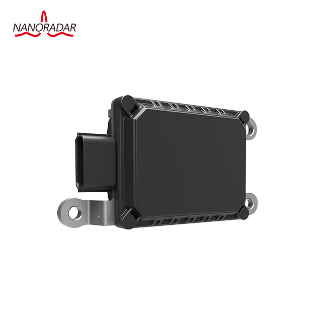
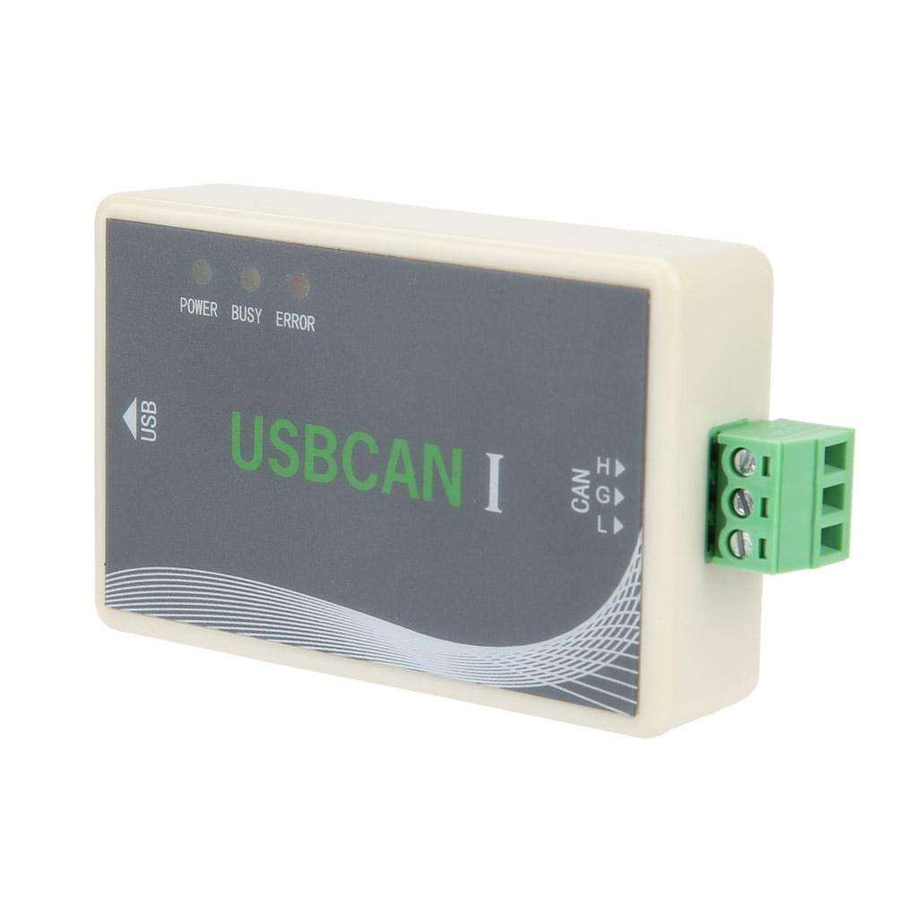

# MR76 Radar Python Driver

This driver provides a high-level Python interface to communicate with the **NanoRadar MR76** over CAN using the **USBCAN-I** interface.

Tested on **Raspberry Pi 5 (AArch64 Linux)**.

<p align="center">
    
    
</p>

## Overview

This driver provides:
- CAN initialization and communication via USBCAN-I
- Parsing of MR76 CAN frames
- High-level Python object abstraction for detected targets
- Optional ROS2 integration example

## System Requirements

### Hardware
- NanoRadar MR76 (500 kbps CAN configuration)
- USBCAN-I adapter
- Raspberry Pi or compatible AArch64 Linux system

### Software
- Linux (AArch64)
- Python 3.10+
- ROS2 (optional, for integration example)

## Installation
Clone the repository:

```
git clone https://github.com/MoradSayed/MR76_Radar.git
```

## Basic usage
Run the module From outside the repository directory:
```
python3 -m MR76_Radar.MR76_radar
```
This will:
- Open the USBCAN device
- Initialize CAN at 500 kbps
- Process incoming frames
- Print detected objects and metadata

## Object Data Model
Each detected object exposes:
| Field        | Type        | Unit   | Description                       |
| ------------ | -----       | ------ | --------------------------------- |
| object_id    | int (0-255) | -      | Radar internal object ID          |
| object_class | IntEnum     | -      | Classified object type            |
| dist_long    | float       | meters | Longitudinal distance             |
| dist_lat     | float       | meters | Lateral distance                  |
| vrel_long    | float       | m/s    | Relative longitudinal velocity    |
| vrel_lat     | float       | m/s    | Relative lateral velocity         |
| rcs          | float       | dBm²   | Radar cross section               |
| dyn_prop     | IntEnum     | -      | Dynamic property                  |


## ROS2 Example Node

Example ROS2 node using this driver:

```python
import rclpy
from rclpy.node import Node
from std_msgs.msg import Float32

from vehicle_interface.MR76_Radar import MR76_radar as mr76
from vehicle_interface.MR76_Radar.usbcan_ii_libusb_aarch64.USBCAN_Interface import ControlCAN, VCI_USBCAN1, STATUS_OK, VCI_INIT_CONFIG


class RadarNode(Node):
    def __init__(self):
        super().__init__("radar")

        self.dist_pub = self.create_publisher(Float32, "/radar_min", 10)
        self.can = ControlCAN()

        if self.can.open_device(VCI_USBCAN1, 0, 0) != STATUS_OK:
            raise ConnectionRefusedError("Failed to open USBCAN-I")

        config = VCI_INIT_CONFIG()
        config.AccCode = 0x00000000
        config.AccMask = 0xFFFFFFFF
        config.Filter = 1
        config.Timing0 = 0x00
        config.Timing1 = 0x1C  # 500 kbps
        config.Mode = 0

        if self.can.init_can(VCI_USBCAN1, 0, 0, config) != STATUS_OK:
            raise RuntimeError("Failed to initialize CAN")
        if self.can.start_can(VCI_USBCAN1, 0, 0) != STATUS_OK:
            raise RuntimeError("Failed to start CAN")

        self.radar = mr76.MR76Radar(self.can, VCI_USBCAN1, 0, 0, sensor_id=0)
        self.timer = self.create_timer(0.02, self.publish_min_vehicle_distance)

    def publish_min_vehicle_distance(self):
        self.radar.process_can_messages(timeout_ms=3)

        min_dist = float("inf")

        for obj in self.radar.get_objects():
            if obj.object_class.name == "VEHICLE":
                min_dist = min(min_dist, obj.dist_long)
        msg = Float32()
        msg.data = obj.dist_long
        self.dist_pub.publish(msg)

    def close(self):
        self.destroy_timer(self.timer)
        self.can.close_device(VCI_USBCAN1, 0)


if __name__ == "__main__":
    rclpy.init()
    node = RadarNode()
    try:
        rclpy.spin(node)
    except KeyboardInterrupt:
        pass
    finally:
        node.close()
        node.destroy_node()
        if rclpy.ok():
            rclpy.shutdown()

```

## License

This project is [licensed](LICENSE) under the [BSD 3-Clause License](https://opensource.org/license/bsd-3-clause).
